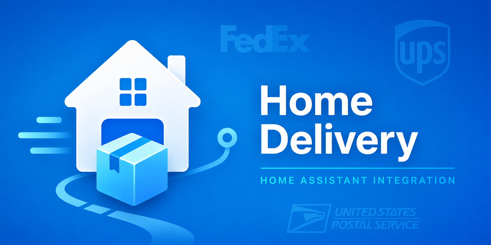

# Home Delivery

Package tracking and USPS Informed Delivery for Home Assistant. Track packages from USPS, UPS, and FedEx with TTS announcements when status changes.

## Features

- **Multi-carrier package tracking** — USPS, UPS, and FedEx with automatic carrier detection
- **USPS Informed Delivery** — See scanned images of incoming mail via IMAP
- **TTS announcements** — Get spoken updates when packages are out for delivery or delivered
- **Adaptive polling** — Hourly by default, every 5 minutes when out for delivery
- **Beautiful UI** — Dark/light themes, auto-saving settings, responsive design (ported from [home-weather](https://github.com/zodyking/home-weather))
- **Home Assistant integration** — Native sensors for packages and mail with rich attributes

## Installation

### As a Home Assistant Add-on

1. Add this repository to your Home Assistant Add-on Store:

   

   Or manually add: `https://github.com/zodyking/Home-Delivery`

2. Install the **Home Delivery** add-on
3. Start the add-on
4. Open the Web UI from the sidebar

The add-on automatically installs a companion integration that creates sensors in Home Assistant.

## Quick Start

1. Open **Home Delivery** from the sidebar
2. Click **Add Package** and enter a tracking number
3. The carrier (USPS/UPS/FedEx) is auto-detected
4. Optionally add who the package is for and the destination

### Mail Tracking (Optional)

1. Go to **Settings** > **Mail**
2. Enter your IMAP server details (e.g., `imap.gmail.com` for Gmail)
3. Enter your email credentials (use an App Password for Gmail with 2FA)
4. Enable mail tracking

### TTS Announcements (Optional)

1. Go to **Settings** > **TTS**
2. Enable TTS announcements
3. Configure which events trigger announcements
4. Set quiet hours to avoid announcements at night

## Entities Created

| Entity | Description |
|--------|-------------|
| `sensor.home_delivery_active_packages` | Count of packages in transit |
| `sensor.home_delivery_out_for_delivery` | Count of packages out for delivery |
| `sensor.home_delivery_delivered_today` | Count of packages delivered today |
| `sensor.home_delivery_usps_mail` | Count of mail pieces today |
| `camera.home_delivery_usps_mail_preview` | Animated GIF of mail scans |
| `sensor.home_delivery_package_*` | Individual package status with attributes |

## Carrier Support

| Carrier | Tracking Format | Example |
|---------|----------------|---------|
| USPS | 20-22 digits starting with 9 | `9400111899560438600329` |
| UPS | 1Z + 16 characters | `1Z999AA10123456784` |
| FedEx | 12 or 15 digits | `123456789012` |

## Architecture

Home Delivery uses a Home Assistant add-on architecture:

- **Add-on container** — Runs FastAPI server with Playwright for scraping, IMAP for mail, and polling scheduler
- **Ingress panel** — Settings and package management UI served via HA Ingress
- **Bundled integration** — Native HA sensors automatically installed on add-on start
- **TTS** — Announcements via Home Assistant's TTS services

## Requirements

- Home Assistant 2024.1.0 or newer
- Home Assistant OS, Supervised, or Container installation (add-on support required)

## Privacy

- All scraping happens locally in the add-on container
- No external services beyond carrier tracking websites
- IMAP credentials stored locally in the add-on config directory
- No data is sent to third parties

## Credits

- UI patterns ported from [home-weather](https://github.com/zodyking/home-weather)
- Add-on architecture inspired by [HA-ConEd](https://github.com/zodyking/HA-ConEd)
- USPS Informed Delivery logic adapted from [Mail-And-Packages](https://github.com/moralmunky/Home-Assistant-Mail-And-Packages)

## Support

For issues and feature requests, [open an issue](https://github.com/zodyking/Home-Delivery/issues).

## License

MIT License - see [LICENSE](LICENSE) for details.
